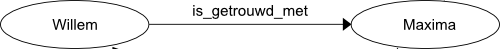
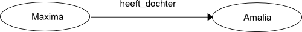
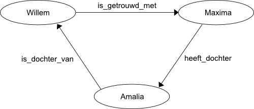
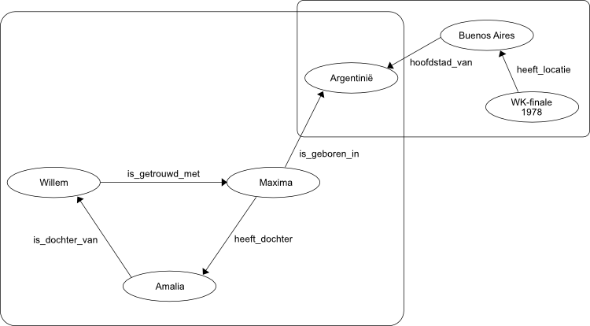

# Linked data
Linked data is een manier om data op te slaan. Je kunt data op veel manieren opslaan. In je geheugen (je trouwdatum), op een kladblaadje, gebeiteld in steen, of in een computer. Bij computers is de meest bekende vorm om data op te slaan een tabel. Denk aan Excel.
Als de hoeveelheid data groot is en de samenhang ingewikkeld heb je soms meerdere tabellen nodig. Meerdere tabellen en hun onderlinge relatie sla je op in een database.

Bij Linked Data sla je data niet op als een tabel, maar als een soort web, waarbij datapunten verbonden worden met andere data punten. Bijvoorbeeld:

Ieder stukje kennis waarover je data hebt, wordt in een patroon zoals hierboven opgeslagen. We noemen dit patroon een triple. Omdat er drie onderdelen zijn.
1. **Subject** het onderwerp (Willem)
2. **Property** de eigenschap (is_getrouwd_met) van het onderwerp
3. **Object** de "waarde" (Maxima) van de eigenschap

We tekenen een triple alijd als twee bolletjes (subject en object) en een pijl (property) die van subject naar object wijst.

## Object als Subject
Het patroon van één triple lijkt natuurlijk niet op een web van data. Dat web ontstaat door meerdere bollen te verbinden met pijlen. In de bovenstaande triple is "Maxima" het object, maar "Maxima" kan tegelijkertijd het Subject zijn van een andere triple.

Door op deze manier subjecten en objecten met elkaar te blijven verbinden ontstaat een web aan Linked Data.

## Hergebruik subjecten en objecten
Doordat binnen Linked Data alle onderdelen van een triple worden geschreven als een webadres, is het eenvoudig om data te hergebruiken in verschillende datasets. Als dat gebeurt is het kinderlijk eenvoudig om datasets aan elkaar te 'linken'. Daarbij blijft het patroon van Linked Data volledig in stand.

Stel de dataset hierboven gebruikt voor het begrip "Argentinië" het webadres "https://nl.wikipedia.org/wiki/Argentinië". En er is een andere dataset over WK's voetbal, die hetzelfde adres gebruikt voor Argentinië. Dan zijn beide sets feitelijk al aan elkaar gekoppeld.

In het plaatje is dan eenvoudig te zien dat "Willem" is verbonden met de "WK-finale 1978" via de stad waar het WK gespeeld is, dat de hoofdstad is van het land waar zijn echtgenoot is geboren.

Door het hergebruik van reeds bestaande webadressen in je eigen data, kun je die eenvoudig verrijken met data die al beschikbaar is over de onderwerpen die voorkomen in je eigen data. De technieken die beschikbaar zijn voor Linked Data zijn er in de kern op gericht om datasets te koppelen. Het is bijvoorbeeld erg eenvoudig om een vraag te stellen aan meedere datasets in één keer, zonder dat je die data eerst in één dataset moet samenbrengen. De data blijft gewoon op de originele lokatie staan en de zogenaamde "federated query" bevraagt de sets als een geheel.
<test>-</test>
